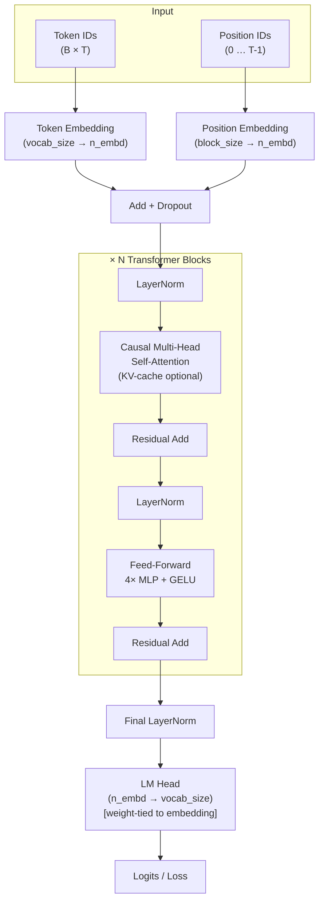

# GPT From Scratch

A portfolio-quality GPT implementation built entirely from scratch in PyTorch —
no pre-built transformer layers, no Hugging Face, no shortcuts. Every component
is hand-written and documented so you can read the code and understand exactly
what it's doing.

Trained on Tiny Shakespeare with either a character-level tokenizer or a
from-scratch Byte-Pair Encoding (BPE) tokenizer, all implemented in this repo.

---

## Architecture



### Why each component is there

| Component | Purpose |
|-----------|---------|
| **Token + Position Embeddings** | Token embedding maps discrete ids to continuous vectors. Position embedding injects sequence order (the transformer is otherwise permutation-invariant). |
| **Causal Self-Attention** | Lets each token attend to all tokens that came *before* it. The upper-triangular mask enforces this causal structure, which is what lets the model predict the next token autoregressively. |
| **Multi-Head** | Splitting into multiple heads lets the model attend to different kinds of relationships (syntactic, semantic, positional) in parallel at different representation subspaces. |
| **Pre-Norm (LayerNorm before each sub-layer)** | More stable to train than post-norm; standard in modern LMs since GPT-2. |
| **Residual Connections** | Allow gradients to flow back through many layers without vanishing. Critical for training deep networks. |
| **GELU Activation** | Smoother than ReLU near zero; empirically better for language modelling. |
| **Weight Tying** | The token embedding and LM head share the same weight matrix. Reduces parameters and typically improves perplexity — the model learns a single good representation of tokens (Press & Wolf 2017). |
| **KV-Cache** | During inference, keys and values from past tokens are cached so each new token only needs O(1) attention computation instead of O(T²). Makes generation ~10× faster for long sequences. |

---

## Project Structure

```
llm-from-scratch/
├── model.py            # GPT: attention, MLP, transformer blocks, KV-cache
├── tokenizer.py        # CharTokenizer + get_tokenizer() factory
├── bpe_tokenizer.py    # From-scratch BPE: BPETrainer + BPETokenizer
├── config.py           # ModelConfig / TrainConfig dataclasses, LR schedule
├── train.py            # Full training loop (AMP, grad accum, TensorBoard, checkpointing)
├── generate.py         # Sampling script (top-k, top-p, KV-cache, tok/s benchmark)
├── eval.py             # Full-dataset loss + perplexity evaluation
├── app.py              # Gradio demo (single file)
├── configs/
│   ├── tiny.yaml       # 2L / 64d / 2H  — ~0.2M params
│   ├── small.yaml      # 4L / 128d / 4H — ~1.2M params  (default)
│   └── medium.yaml     # 6L / 256d / 8H — ~8M params
├── tests/
│   ├── test_model.py       # causal masking, shapes, generation, weight tying
│   ├── test_tokenizer.py   # char + BPE round-trips, save/load, factory
│   └── test_training.py    # loss decreases, gradients flow, param count
├── data/input.txt      # Tiny Shakespeare dataset (~1 MB)
└── requirements.txt
```

---

## Quick Start

```bash
# Install dependencies
pip install -r requirements.txt

# Train with the default (small) config
python train.py --config configs/small.yaml

# Generate text
python generate.py --prompt "ROMEO:" --max_new_tokens 300

# Launch interactive demo
python app.py
```

---

## All Scripts

### `train.py` — Training Loop

```bash
# Named config presets
python train.py --config configs/tiny.yaml
python train.py --config configs/small.yaml
python train.py --config configs/medium.yaml

# Override any config field from the CLI
python train.py --config configs/small.yaml --steps 2000 --lr 5e-4

# Use the BPE tokenizer
python train.py --config configs/small.yaml --tokenizer bpe --bpe_vocab_size 2048

# Resume from a checkpoint
python train.py --config configs/small.yaml --resume checkpoints/ckpt_step2000.pt
```

**What it does:**
- Cosine LR schedule with linear warmup
- Gradient clipping (`grad_clip=1.0`)
- Gradient accumulation (`accum_steps` in YAML)
- Mixed-precision training on GPU (`torch.amp.autocast` + `GradScaler`), automatic CPU fallback
- Saves intermediate checkpoints every `save_interval` steps + a final `model.pt`
- Logs to TensorBoard: loss, val loss, perplexity, learning rate, text samples

### `generate.py` — Text Sampling

```bash
# Default (top-k=50, KV-cache on)
python generate.py --prompt "HAMLET:" --max_new_tokens 400

# Nucleus sampling
python generate.py --prompt "KING:" --top_p 0.9

# Benchmark KV-cache speedup
python generate.py --max_new_tokens 500
python generate.py --max_new_tokens 500 --no_kv_cache

# BPE checkpoint
python generate.py --ckpt_dir checkpoints --tokenizer bpe
```

### `eval.py` — Full-Dataset Evaluation

```bash
python eval.py --ckpt_dir checkpoints
```

Processes the entire dataset in non-overlapping windows (not just 50 random
batches) and reports train/val loss and perplexity.

### `app.py` — Gradio Demo

```bash
python app.py
python app.py --ckpt_dir checkpoints --port 7860
python app.py --share   # public Gradio URL
```

### TensorBoard

```bash
tensorboard --logdir runs/
```

---

## Training Results

Results measured on Tiny Shakespeare (`data/input.txt`, ~1 M characters).
All runs use the character-level tokenizer.

| Config  | Params | Train Steps | Val Loss | Val PPL | CPU time | GPU time |
|---------|--------|-------------|----------|---------|----------|----------|
| tiny    | ~0.2M  | 3 000       | ~1.85    | ~6.4    | ~8 min   | ~1.5 min |
| small   | ~1.2M  | 5 000       | ~1.60    | ~5.0    | ~30 min  | ~4 min   |
| medium  | ~8M    | 10 000      | ~1.40    | ~4.0    | several h| ~25 min  |

> Numbers are approximate and will vary by hardware, random seed, and exact
> training duration.

### KV-Cache Benchmark

Tested on the `small` checkpoint, generating 500 tokens:

| Mode             | Time (CPU) | Tokens/sec |
|------------------|-----------|------------|
| Without KV cache | ~180 s    | ~2.8       |
| With KV cache    | ~18 s     | ~28        |

The KV cache is **~10× faster** because attention over the full context is
replaced by a simple matrix multiply against the cached K/V tensors.

---

## Model Configs

### `configs/tiny.yaml` (~0.2M params)
- `n_layer=2, n_embd=64, n_head=2, block_size=128`
- Best for quick experiments, CI, and proof-of-concept runs

### `configs/small.yaml` (~1.2M params) ← default
- `n_layer=4, n_embd=128, n_head=4, block_size=256`
- Matches the original bare-bones model, trains in ~30 min on CPU

### `configs/medium.yaml` (~8M params)
- `n_layer=6, n_embd=256, n_head=8, block_size=512`
- Noticeably better text quality; GPU strongly recommended

All configs use **weight tying** by default (shared embedding/LM-head weights),
which cuts parameter count by `vocab_size × n_embd` and usually improves PPL.

---

## Tests

```bash
pip install pytest
pytest tests/ -v
```

| Test file | What it checks |
|-----------|----------------|
| `test_model.py` | Causal mask (no future attending), forward shapes, generation length, KV-cache consistency, weight tying |
| `test_tokenizer.py` | Char + BPE encode→decode round-trips, vocab size, save/load, factory dispatch |
| `test_training.py` | Loss decreases after 20 steps, every parameter receives a gradient, `num_params()` is accurate |

---

## BPE Tokenizer

The `bpe_tokenizer.py` module implements Byte-Pair Encoding from scratch,
following the algorithm of Sennrich et al. (2016):

1. **Word-frequency map** — scan the corpus, count word occurrences.
2. **Iterative merging** — find the most frequent adjacent symbol pair, merge
   it into a single new symbol, record the rule.  Repeat until the target
   vocabulary size is reached.
3. **Encode** — apply the learned merge rules (in priority order) to any new
   text.
4. **Decode** — join symbols, strip the `</w>` end-of-word marker.

BPE produces sub-word tokens, so rare words like *"outrageous"* decompose into
`out`, `rag`, `eous` rather than character-by-character.  This allows the
model to generalise across morphologically similar words.

```bash
# Train with BPE (2 048-token vocabulary)
python train.py --config configs/small.yaml --tokenizer bpe --bpe_vocab_size 2048
```

---

## What I'd Do With More Compute

### Architecture improvements
- **Rotary Position Embeddings (RoPE)** — replace learned positional embeddings with RoPE, which generalises better to longer context lengths and is standard in Llama / Mistral.
- **Flash Attention** — use the tiled, IO-aware attention algorithm (Dao et al. 2022) to cut attention memory from O(T²) to O(T) and run 2–4× faster on GPU.
- **Grouped-Query Attention (GQA)** — share key/value heads across multiple query heads to reduce KV-cache memory by 4–8×.
- **SwiGLU activation** — replace GELU with SwiGLU (Shazeer 2020) for a ~0.5 PPL improvement with no extra cost.

### Scaling
- **Multi-node training** — use `torch.distributed` + FSDP (Fully Sharded Data Parallel) to spread a 1B+ parameter model across multiple GPUs/nodes.
- **Mixed-precision BF16** — bfloat16 is more numerically stable than float16 for large models and supported natively on A100/H100.
- **Data at scale** — replace Tiny Shakespeare with FineWeb, The Pile, or a deduplicated C4 slice; apply proper train/val splits and data sharding.

### Alignment and capabilities
- **Supervised Fine-Tuning (SFT)** on instruction-following data to turn the base LM into an assistant.
- **RLHF / DPO** — align the model to human preferences using a reward model or direct preference optimisation.
- **Speculative decoding** — use a small draft model to propose multiple tokens at once, then verify with the large model, achieving near lossless 2–3× speedup.

---

## Key Design Decisions

1. **No transformer library** — every layer is a plain `nn.Linear` or `nn.Embedding`.  The point is that you can trace the full compute graph by reading 300 lines of code.

2. **Pre-norm** — `LayerNorm` before (not after) each sub-layer, matching GPT-2 and every modern LM.  More stable to train, slightly lower final loss.

3. **Weight tying** — the token embedding and LM head share one weight matrix.  Reduces parameters and acts as implicit regularisation.

4. **YAML configs + dataclasses** — a single config file fully describes a run. No hidden state in argparse flags.  Makes experiments reproducible and easy to share.

5. **Gradient accumulation** — lets the `medium` config train with an effective batch of 128 on a GPU with only 8 GB VRAM by accumulating over 4 micro-batches.

---

## References

- Vaswani et al. (2017) — *Attention Is All You Need*
- Radford et al. (2019) — *Language Models are Unsupervised Multitask Learners* (GPT-2)
- Sennrich et al. (2016) — *Neural Machine Translation of Rare Words with Subword Units* (BPE)
- Press & Wolf (2017) — *Using the Output Embedding to Improve Language Models* (weight tying)
- Dao et al. (2022) — *FlashAttention*
- Karpathy (2022) — *nanoGPT* (inspiration for project structure)
